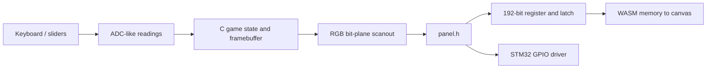

# LED-panel Pong and browser emulator

A two-player Pong game in C, with a browser emulator that runs the same game and scanout code through WebAssembly. The useful engineering boundary is the **serial panel protocol**: the game emits bits, selects a row and latches a register; the browser displays the resulting pixels. That makes bit ordering, row selection and incomplete register updates directly inspectable.

**[Play the browser demo](https://tahakhanm.github.io/led-panel-pong-emulator/)** · [Coursework report](docs/CS132_Report_Draft_2.pdf) · [Native regression tests](tests/)

The original CS132 coursework report is credited to **Serena Jacob and Taha Khan**. The kit and exercise came from the course; [the lab handout](docs/CS132_LED_Panel.pdf) credits A. Hague and R. Suma, adapted from R. Kirk. The shared game, browser port and repository are the implementation under review. The report does not give a precise per-person division of the implementation, so this should be presented as collaborative work.

## Play or build

Hold **W and ↑ together** to leave the start screen. The left paddle uses **W/S**, the right uses **↑/↓**; on-screen buttons and sliders provide equivalent input. After a point, move the serving paddle to serve. First to ten wins.

- **Pause / Resume** or Space when the page body is focused, controls execution.
- **Step row** advances one scan boundary while paused; it is not one whole game frame.
- **L** switches between the integrated display and the currently addressed row pair.
- **Reset** reloads the program.

Build locally with an activated Emscripten SDK providing `emcc`, Python 3 and a C compiler:

```bash
make test
make web
./emulator/scripts/serve.sh
```

Open `http://127.0.0.1:8000`. Serving checks that both generated files exist; opening the HTML directly from disk is insufficient for loading WASM. The browser bridge can also be checked with `node tests/test_browser.js`.

`make web` compiles `src/game.c` and `emulator/src/panel_emu.c`, adding the shared header path and enabling Asyncify. It produces `emulator/web/pong.js` and `pong.wasm`; generated binaries are ignored rather than committing an incomplete JavaScript artifact without its matching WASM. GitHub Actions runs the native and JavaScript checks, builds with Emscripten and publishes the static demo.

## How the layers fit



[game.c](src/game.c) owns the 32×32 character-colour framebuffer, paddle calibration, ball motion, collisions, scoring and start/play/serve/win states. It depends only on [panel.h](src/panel.h) for input, timing and output. The linker selects either the browser or STM32 implementation.

The software protocol uses **zero-based row addresses 0–15**, each selecting row `r` and `r+16`. For each pair the game shifts 32 red, 32 green and 32 blue bits for the top row, then the same for the bottom: **192 bits per latch, 3,072 bits per full refresh**. The register retains the newest 192 bits in a circular buffer. Shifting alone cannot change the latched framebuffer; `LatchRegister` decodes the register at the selected row. No zero-clear pass is needed before overwriting all 192 bits.

The C bridge passes the current `HEAPU8` view alongside the framebuffer pointer to JavaScript. This avoids depending on incidental global heap exports and refreshes the view after WebAssembly memory growth. JavaScript reads those pixels into a reused `ImageData` buffer; it does not independently simulate paddles or collisions.

`emscripten_sleep` and Asyncify let an embedded-style loop yield to the browser event loop. This keeps the shared C control flow simple, at the cost of transformed code and approximate timing. A callback-driven update loop would reduce that machinery but require restructuring the game. The UI counter is explicitly **row latches per second**, not full-frame FPS. Browser scheduling and the uncalibrated hardware delay prevent a reliable real-time performance claim.

## What is verified

Native tests compile with `-Wall -Wextra -Werror` and **AddressSanitizer plus UndefinedBehaviorSanitizer**. They check exact RGB bit positions, 192-bit scan payloads, all 16 addresses, register overflow, latch visibility, row isolation and clearing. Game regressions cover ADC extremes, paddle near-misses, collision direction, serve velocity reset, clipped drawing, invalid glyphs and the winner surviving later animation ticks. The JavaScript test checks ADC mapping, step tokens and rendering from an explicit heap view.

The 2026 revision fixes an uninitialised winner variable, stale vertical velocity between serves, false paddle collisions outside the visible paddle, a missing boolean grouping in serve logic and undefined colour/glyph lookup behavior. It bounds framebuffer writes and gives the long-running cycle counter unsigned wraparound semantics. On the browser side it fixes pointer-event handling, clears held keys after focus loss, labels sliders, preserves visible keyboard focus, prevents arrow-key page scrolling during play and labels the previous “Start” control according to its actual resume behavior.

It also corrects the emulator's previous one-based row offset to match the hardware driver's raw address bits, removes misleading comments and dead debug code and makes the browser build self-contained. The original report and Git history remain the record of the coursework; current tests and repairs are subsequent improvements.

## Physical hardware and scope

This is a **software protocol emulator**, not a cycle-accurate electrical model. The browser verifies the RGB-plane convention used by the game. The lab handout describes a different physical colour-chain ordering and the actual kit's chain direction, latch polarity and address wiring have not been revalidated. The former claim of exact hardware fidelity was stronger than the evidence supported.

The STM32 build still needs the missing coursework `rules.mk`, a built libopencm3 checkout and an ARM toolchain; [hardware/README.md](hardware/README.md) explains the concrete prerequisites. Its delay loop is not a millisecond timer and ADC setup/calibration needs a hardware pass. The Makefile now finds the shared game source and reports missing prerequisites, but no working firmware binary is claimed.

The game uses fixed geometry, global state and discrete per-tick collision checks. That is manageable for this small program; a variable-speed physics engine would need swept collisions or a smaller integration step to avoid tunnelling. The integrated browser framebuffer also does not model duty-cycle brightness, PWM, ghosting or GPIO timing. Those are useful boundaries to discuss in an interview: the emulator tests the software's register contract, while the physical device requires separate measurements.
