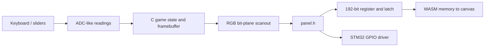

# LED-panel Pong

A two-player Pong game in C and a WebAssembly emulator for a 32×32 RGB panel. The browser runs the same game and scanout code as the hardware path, then displays pixels decoded from the emulated serial register.

**[Play in your browser](https://tahakhanm.github.io/led-panel-pong-emulator/)** · [Coursework report](docs/CS132_Report_Draft_2.pdf) · [Tests](tests/)

The emulator makes the panel protocol visible: bits are shifted into a 192-bit register, a row pair is selected and a latch updates the display. Pausing and stepping through a row lets you inspect the process directly.

## Play or build

Hold **W and ↑ together** to leave the start screen. The left paddle uses **W/S**, the right uses **↑/↓**; on-screen buttons and sliders provide equivalent input. After a point, move the serving paddle to serve. First to ten wins.

- **Pause / Resume** or Space when the page body is focused, controls execution.
- **Step row** advances one scan boundary while paused; it is not one whole game frame.
- **L** switches between the integrated display and the currently addressed row pair.
- **Reset** reloads the program.

Build locally with an activated Emscripten SDK providing `emcc`, Python 3 and a C compiler:

```bash
make test
make web
./emulator/scripts/serve.sh
```

Open `http://127.0.0.1:8000`. Serving checks that both generated files exist; opening the HTML directly from disk is insufficient for loading WASM. The browser bridge can also be checked with `node tests/test_browser.js`.

`make web` compiles `src/game.c` and `emulator/src/panel_emu.c`, adding the shared header path and enabling Asyncify. It produces `emulator/web/pong.js` and `pong.wasm`; Both generated files are ignored by Git. GitHub Actions runs the native and JavaScript checks, builds with Emscripten and publishes the static demo.

## How the layers fit



[game.c](src/game.c) owns the 32×32 character-colour framebuffer, paddle calibration, ball motion, collisions, scoring and start/play/serve/win states. It depends only on [panel.h](src/panel.h) for input, timing and output. The linker selects either the browser or STM32 implementation.

The software protocol uses **zero-based row addresses 0–15**, each selecting row `r` and `r+16`. For each pair the game shifts 32 red, 32 green and 32 blue bits for the top row, then the same for the bottom: **192 bits per latch, 3,072 bits per full refresh**. The register retains the newest 192 bits in a circular buffer. Shifting alone cannot change the latched framebuffer; `LatchRegister` decodes the register at the selected row. No zero-clear pass is needed before overwriting all 192 bits.

The C bridge passes the current `HEAPU8` view alongside the framebuffer pointer to JavaScript. This avoids depending on incidental global heap exports and refreshes the view after WebAssembly memory growth. JavaScript reads those pixels into a reused `ImageData` buffer; it does not independently simulate paddles or collisions.

`emscripten_sleep` and Asyncify let an embedded-style loop yield to the browser event loop. This keeps the shared C control flow simple, at the cost of transformed code and approximate timing. A callback-driven update loop would reduce that machinery but require restructuring the game. The UI counter is explicitly **row latches per second**, not full-frame FPS. Browser scheduling and the uncalibrated hardware delay prevent a reliable real-time performance claim.

## Verification

Native tests compile with `-Wall -Wextra -Werror`, AddressSanitizer and UndefinedBehaviorSanitizer. They check RGB bit positions, scan payloads, all 16 row addresses, register overflow and latch visibility. Game regressions cover collisions, serve resets, clipped drawing and winner state. JavaScript checks cover input mapping, stepping and rendering from WebAssembly memory.

Later repairs fixed an uninitialised winner, stale serve velocity, false paddle collisions and invalid framebuffer access. The browser handles focus loss and pointer input, while the build produces JavaScript and WASM together. CI runs native and browser-bridge tests before building the demo.

## Hardware and credits

The original CS132 report is by **Serena Jacob and Taha Khan**. The [lab handout](docs/CS132_LED_Panel.pdf) credits A. Hague and R. Suma, adapted from R. Kirk.

The STM32 path requires the coursework `rules.mk`, libopencm3 and an ARM toolchain. [Hardware setup](hardware/README.md) lists the missing prerequisites. The browser checks the software register protocol; physical chain ordering, GPIO timing and ADC calibration still need testing on the kit. It does not simulate electrical timing, brightness or ghosting.

The coursework report and original history remain intact. The browser port and regression repairs are subsequent work.
